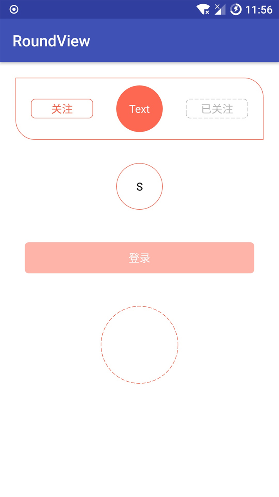

# RoundView
[](https://jitpack.io/#ZQ7/RoundView)



设置圆角、背景、边框、颜色及更改状态后的圆角、背景、边框、颜色、文字等

## Gradle

``` groovy
repositories { 
    maven { url "https://jitpack.io" }
}
```  
    
``` groovy
dependencies {
    compile 'compile 'com.yi2580.roundview:RoundView:1.0.1''
}
```
**属性**

    <!-- 背景色 -->
    <attr name="viewSolidColor" format="color" />
    <!-- 边框色 -->
    <attr name="viewStrokeColor" format="color" />
    <!-- 边框厚度 -->
    <attr name="viewStrokeWidth" format="dimension" />
    <!-- 边框虚线长度 -->
    <attr name="viewStrokeDashWidth" format="dimension" />
    <!-- 边框虚线间隙 -->
    <attr name="viewStrokeDashGap" format="dimension" />
    <!-- 圆角半径-->
    <attr name="viewCornerRadius" format="dimension" />
    <!-- 设置viewCornerRadius后，下面设置无效 -->
    <attr name="viewTopLeftRadius" format="dimension" />
    <attr name="viewTopRightRadius" format="dimension" />
    <attr name="viewBottomLeftRadius" format="dimension" />
    <attr name="viewBottomRightRadius" format="dimension" />
    <!-- 显示类型 默认rectangle -->
    <attr name="viewShapeTpe" format="enum">
        <enum name="rectangle" value="0"></enum>
        <enum name="oval" value="1"></enum>
        <enum name="line" value="2"></enum>
        <enum name="ring" value="3"></enum>
    </attr>
    
    

**RoundTextView:**

	可设置圆角、背景、边框、颜色及选中后的圆角、背景、边框、颜色、文字等
	
	 <!--setSelected()，改变背景色、边框色、字体色、文字-->
    <declare-styleable name="RoundTextView">
        <!-- 文字颜色 -->
        <attr name="rTextColor" format="color" />
        <attr name="rTextSelectedColor" format="color" />
        <!-- 选中和非选中的Text(覆盖android:text="")，如果一致课直接设置android:text="" -->
        <attr name="rStateText" format="reference" />
        <!-- 背景色 -->
        <attr name="viewSolidColor" />
        <attr name="viewSolidSelectedColor" format="color" />
        <!-- 边框色 -->
        <attr name="viewStrokeColor" />
        <attr name="viewStrokeSelectedColor" format="color" />
        <attr name="viewStrokeWidth" /><!-- 边框厚度 -->
        <attr name="viewStrokeDashWidth" /><!-- 边框虚线长度 -->
        <attr name="viewStrokeDashGap" /><!-- 边框虚线间隙 -->
        <attr name="viewShapeTpe" /><!-- 显示类型 -->
        <attr name="viewCornerRadius" /><!-- 圆角半径-->
        <!-- 设置viewCornerRadius后，下面设置无效 -->
        <attr name="viewTopLeftRadius" />
        <attr name="viewTopRightRadius" />
        <attr name="viewBottomLeftRadius" />
        <attr name="viewBottomRightRadius" />
        <!-- 自动计算按下(pressed)状态颜色的系数, 值为0时不自动计算 -->
        <attr name="viewPressedRatio" format="float" />
    </declare-styleable>
	
	
	
**EnabledTextView：**

	根据是否可设置圆角、背景、边框、颜色及选中后的圆角、背景、边框、颜色、文字等
	
	 <!--setEnabled()，改变背景色、边框色、字体色、文字-->
    <declare-styleable name="EnabledTextView">
        <!-- 文字颜色 -->
        <attr name="eTextColor" format="color" />
        <attr name="eTextEnabledColor" format="color" />
        <!-- 可点击和不可点击的Text(覆盖android:text="")，如果一致课直接设置android:text="" -->
        <attr name="eStateText" format="reference" />
        <!-- 背景色 -->
        <attr name="viewSolidColor" />
        <attr name="viewSolidEnabledColor" format="color" />
        <!-- 边框色 -->
        <attr name="viewStrokeColor" />
        <attr name="viewStrokeEnabledColor" format="color" />
        <attr name="viewStrokeWidth" /><!-- 边框厚度 -->
        <attr name="viewStrokeDashWidth" /><!-- 边框虚线长度 -->
        <attr name="viewStrokeDashGap" /><!-- 边框虚线间隙 -->
        <attr name="viewShapeTpe" /><!-- 显示类型 -->
        <attr name="viewCornerRadius" /><!-- 圆角半径-->
        <!-- 设置viewCornerRadius后，下面设置无效 -->
        <attr name="viewTopLeftRadius" />
        <attr name="viewTopRightRadius" />
        <attr name="viewBottomLeftRadius" />
        <attr name="viewBottomRightRadius" />
        <!-- 自动计算按下(pressed)状态颜色的系数, 值为0时不自动计算 -->
        <attr name="viewPressedRatio" format="float" />
    </declare-styleable>
	
	
**RoundLinearLayout/RoundRelativeLayout：**
	
	    <!--背景、边框、圆角、圆形Layout-->
    <declare-styleable name="RoundLatout">
        <attr name="viewSolidColor" /><!-- 背景色 -->
        <attr name="viewStrokeColor" /><!-- 边框色 -->
        <attr name="viewStrokeWidth" /><!-- 边框厚度 -->
        <attr name="viewStrokeDashWidth" /><!-- 边框虚线长度 -->
        <attr name="viewStrokeDashGap" /><!-- 边框虚线间隙 -->
        <attr name="viewShapeTpe" /><!-- 显示类型 -->
        <attr name="viewCornerRadius" /><!-- 圆角半径-->
        <!-- 设置viewCornerRadius后，下面设置无效 -->
        <attr name="viewTopLeftRadius" />
        <attr name="viewTopRightRadius" />
        <attr name="viewBottomLeftRadius" />
        <attr name="viewBottomRightRadius" />
    </declare-styleable>
	
	
	
	
	
	
	